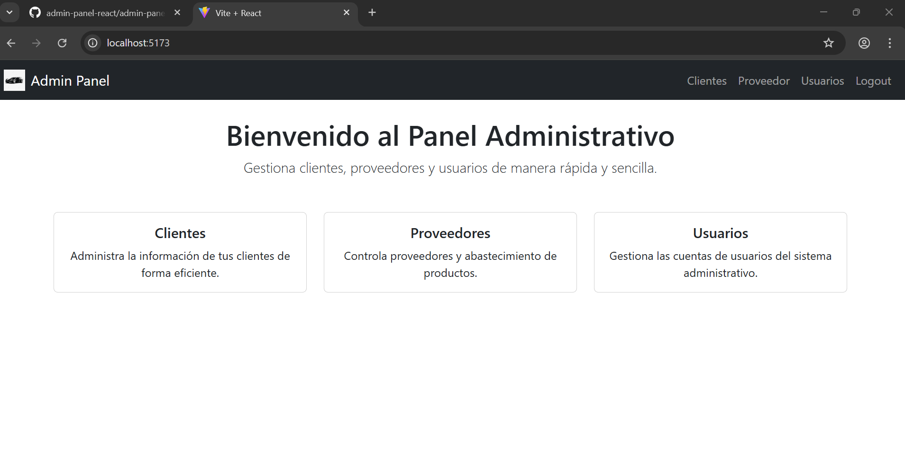

# Panel Administrativo Web con React JS

Este proyecto es un ejercicio práctico para la materia de Ingeniería de Sistemas e Informática, donde se construye un panel administrativo usando React JS y Vite.

## Características

- Barra de navegación moderna usando Bootstrap.
- Páginas para Clientes, Proveedor, Usuarios y Logout.
- Navegación entre páginas usando React Router DOM sin recargar el navegador.
- Estilos aplicados utilizando Bootstrap 5.

## Pasos Seguidos

1. Crear el proyecto con Vite + React (`npm create vite@latest`).
2. Instalar Bootstrap y React Router DOM (`npm install bootstrap react-router-dom`).
3. Crear componentes y páginas siguiendo la estructura solicitada.
4. Implementar navegación usando `<BrowserRouter>`, `<Routes>` y `<Route>`.
5. Aplicar clases de Bootstrap para una presentación moderna.
6. Documentar y preparar el proyecto para su entrega.

## Captura de pantalla

<<<<<<< HEAD


=======

>>>>>>> 90ceb30adfa069b1b46052a4c9c1a1e4668e795d


## Cómo ejecutar el proyecto

1. Clonar el repositorio.
2. Instalar dependencias:

```bash
npm install
